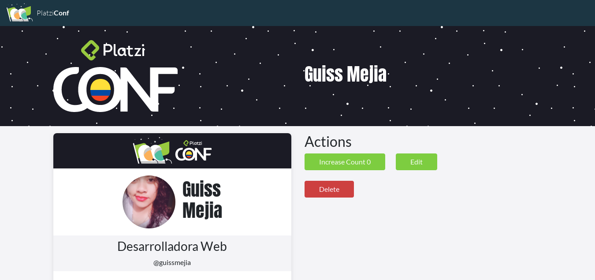

# Platzi-Badges

This application is created for the management of people who will attend an event allowing to manage the registration, editing, updating and deletion of users.

## Installation

```bash
npm install
```

## Execution

```bash
npm run start
```

## Preview


